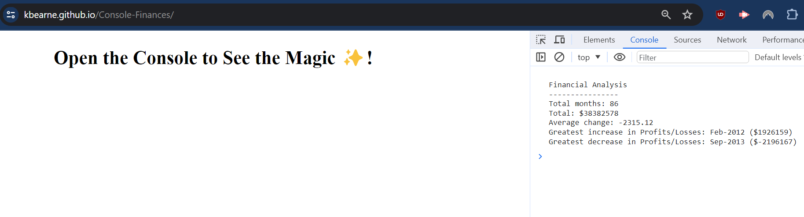

# Console-Finances

## Description

This project fullfils the criteria of building an app (in JavaScript) which analyzes a record set to calculate each of the following:

- The total number of months included in the dataset.
- The net total amount of Profit/Losses over the entire period.
- The average of the changes in Profit/Losses over the entire period.
- The greatest increase in profits (date and difference in the amounts) over the entire period.
- The greatest decrease in losses (date and difference in the amounts) over the entire period.

## Installation

N/A

## Usage

Access the deployed application at the following URL: https://kbearne.github.io/Console-Finances/

Results of the script can be viewed in the console.

## Built with

 

## License

MIT license